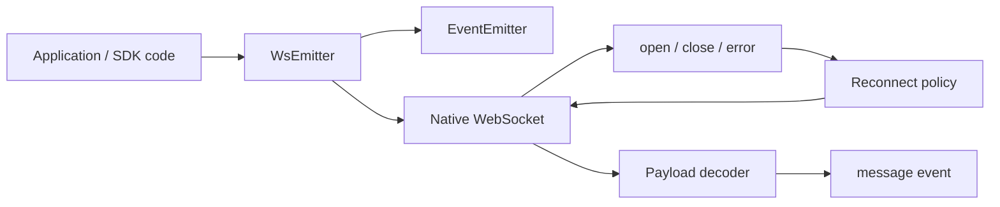

# ws-emitter

Small TypeScript WebSocket infrastructure for applications that need predictable realtime behavior without adopting a full framework.

`ws-emitter` wraps the native `WebSocket` API with a compact event-driven interface, explicit lifecycle control, defensive payload parsing, and configurable reconnect behavior. It is designed as low-level infrastructure: easy to inspect, easy to test, and small enough to embed inside UI applications, SDKs, or service-facing browser code.

## Why this exists

Native WebSocket is intentionally low-level. That is useful for simple demos, but production code quickly needs the same decisions around lifecycle, reconnection, parsing, shutdown semantics, and subscription cleanup.

This package turns those decisions into a small, explicit abstraction:

- one client object owns the socket lifecycle;
- consumers subscribe through `on` / `once` and receive an unsubscribe function;
- unexpected closes can reconnect automatically;
- intentional closes can stop reconnects explicitly;
- incoming payloads are normalized before they reach application code;
- MessagePack support is opt-in instead of leaking binary protocol details into every consumer.

The result is not a realtime framework. It is a focused transport primitive that keeps application code away from repetitive WebSocket glue while preserving the native model underneath.

## Highlights

- **Small public API** — `connect`, `close`, `on`, `once`, and `emit`.
- **Predictable reconnect semantics** — temporary network failures and intentional shutdowns are treated differently.
- **Manual lifecycle mode** — disable auto-connect when the owner is a React effect, SDK initializer, test harness, or service bootstrap.
- **Defensive payload decoding** — JSON is parsed when possible; invalid or unsupported payloads fall back to raw values.
- **Optional MessagePack decoding** — binary event streams can be consumed through `msgpackr`.
- **TypeScript declarations** — the package is built for downstream library consumers, not only local application code.
- **Jest-covered core behavior** — event semantics and socket lifecycle behavior are tested.
- **No framework assumptions** — usable from browser UI code, shared SDK packages, or integration layers.

## Installation

```bash
npm install ws-emitter
```

```bash
yarn add ws-emitter
```

## Quick start

```ts
import { WsEmitter } from 'ws-emitter'

const socket = new WsEmitter('wss://example.com/events')

const unsubscribe = socket.on('message', (payload) => {
  console.log('message', payload)
})

socket.on('open', () => {
  console.log('connected')
})

socket.on('close', () => {
  console.log('connection closed')
})

unsubscribe()
```

## Lifecycle control

Use the default mode when the client should connect as soon as it is created.

```ts
const socket = new WsEmitter('wss://example.com/events')
```

Use manual mode when connection timing belongs to the host application. This is useful in UI effects, SDK bootstrapping, integration tests, or flows where authentication must complete first.

```ts
const socket = new WsEmitter('wss://example.com/events', {
  autoConnect: false,
  autoReconnect: true,
  reconnectTimeout: 1500,
})

socket.connect()

// Intentional shutdown: this close should not schedule a reconnect.
socket.close(true)
```

## Payload handling

Incoming messages are decoded before they are emitted to consumers. The decoder is intentionally defensive: malformed JSON, unknown payload shapes, or unsupported binary data should not crash application listeners. When structured decoding is not possible, the original payload is forwarded.

### JSON stream

```ts
const socket = new WsEmitter('wss://example.com/json-events')

socket.on('message', (payload) => {
  // payload is parsed JSON when the server sends valid JSON
  console.log(payload)
})
```

### MessagePack stream

```ts
const socket = new WsEmitter(
  'wss://example.com/binary-events',
  { autoReconnect: true },
  true,
)

socket.on('message', (payload) => {
  // payload is decoded through msgpackr when binary decoding is enabled
  console.log(payload)
})
```

## API

### `new WsEmitter(url, options?, isMessagePack?)`

Creates a WebSocket wrapper and connects immediately unless `autoConnect` is disabled.

```ts
type OptionsType = {
  autoConnect?: boolean
  autoReconnect?: boolean
  reconnectTimeout?: number
}
```

| Option | Default | Description |
| --- | --- | --- |
| `autoConnect` | `true` | Open the socket during construction. |
| `autoReconnect` | `true` | Reconnect after an unexpected close event. |
| `reconnectTimeout` | `1000` | Delay in milliseconds before the next reconnect attempt. |

### `connect()`

Creates a new native `WebSocket` instance and attaches lifecycle handlers.

### `close(force = false)`

Closes the current socket. When `force` is `true`, reconnect is disabled for that close cycle.

### `on(eventName, listener)`

Subscribes to an event and returns an unsubscribe function.

```ts
const off = socket.on('message', handleMessage)
off()
```

### `once(eventName, listener)`

Subscribes to a single event delivery and removes the listener after the first call.

### `emit(eventName, payload)`

Triggers local listeners. This does not send data to the remote server.

## Events

| Event | Payload |
| --- | --- |
| `open` | Native WebSocket open event |
| `close` | Native WebSocket close event |
| `error` | Native WebSocket error event |
| `message` | Parsed JSON, decoded MessagePack object, or raw fallback |

## Architecture



## Design decisions

- The package stays close to the native WebSocket model instead of inventing a custom realtime protocol.
- `emit` is local-only by design; client-side events and transport writes are not mixed.
- Reconnect is driven by close semantics, so explicit shutdown can be handled differently from a network drop.
- Parsing failures are isolated from subscribers; consumers can decide what to do with raw fallback payloads.
- MessagePack support is opt-in to keep the default JSON path simple and easy to debug.
- The public API is intentionally small, which makes the client suitable as a lower-level primitive inside larger systems.

## Production usage notes

This library is best used as a transport primitive, not as an application state container. A typical production setup keeps domain-specific state elsewhere and uses `ws-emitter` only for connection lifecycle and incoming event delivery.

Recommended patterns:

- keep authentication and URL creation outside the client;
- create one client per realtime stream or ownership boundary;
- always store and call unsubscribe functions in UI code;
- use `autoConnect: false` when connection order matters;
- call `close(true)` for intentional teardown to avoid reconnect loops;
- handle raw fallback payloads as part of the consumer contract.

## Testing strategy

The core behavior is tested around the parts that usually regress in WebSocket wrappers:

- event subscription and unsubscription;
- one-time listeners;
- lifecycle event forwarding;
- reconnect behavior after unexpected closes;
- forced close behavior;
- payload decoding paths.

## Development

```bash
npm install
npm test
npm run build
```

## Build output

The package is built as a library artifact rather than an application bundle. The build produces distributable JavaScript and TypeScript declaration files under `dist`, so consumers get both runtime code and editor/type support.

The intended package shape is:

- source code in `src`;
- tests close to the behavior they validate;
- generated artifacts in `dist`;
- a narrow public entry point for consumers.

## License

MIT
