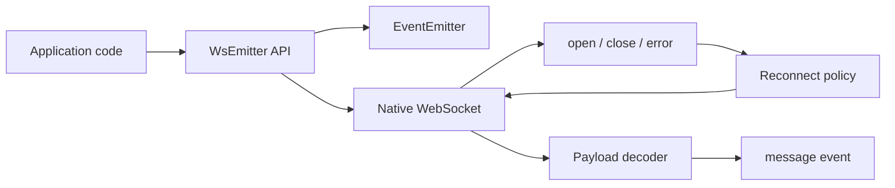

# ws-emitter

A small TypeScript WebSocket client built around an event-driven API, predictable reconnect behavior, and optional MessagePack decoding.

`ws-emitter` is intentionally compact: it does not try to become a full realtime framework. It gives product code the few primitives that are usually needed around native WebSocket — lifecycle events, message subscriptions, controlled reconnects, and safe payload decoding — while keeping the transport layer easy to inspect and debug.

## Why this exists

Native WebSocket is low-level. In real applications the same glue code tends to appear again and again:

- subscribe to `open`, `close`, `error`, and `message`
- normalize string and binary payloads
- reconnect after temporary network failures
- stop reconnecting when the close was intentional
- keep the API small enough to be used inside UI, SDK, or service code

This package wraps those concerns into a minimal client without hiding the underlying WebSocket model.

## Highlights

- **Event-driven API** — `on`, `once`, `emit`, and unsubscribe support.
- **Automatic reconnects** — configurable reconnect delay with explicit force-close behavior.
- **Manual connection control** — opt out of auto-connect when the consumer owns the lifecycle.
- **Payload normalization** — JSON parsing with fallback to raw data.
- **Optional MessagePack support** — binary messages can be decoded through `msgpackr`.
- **TypeScript-first build** — declaration files are generated for library consumers.
- **Tested core behavior** — emitter semantics and WebSocket lifecycle are covered with Jest.
- **Small surface area** — designed as infrastructure code that is easy to reason about.

## Installation

```bash
npm install ws-emitter
```

```bash
yarn add ws-emitter
```

## Quick start

```ts
import { WsEmitter } from 'ws-emitter'

const socket = new WsEmitter('wss://example.com/events')

socket.on('open', () => {
  console.log('connected')
})

socket.on('message', (payload) => {
  console.log('message', payload)
})

socket.on('close', () => {
  console.log('connection closed')
})
```

## Manual lifecycle control

```ts
const socket = new WsEmitter('wss://example.com/events', {
  autoConnect: false,
  autoReconnect: true,
  reconnectTimeout: 1500,
})

socket.connect()

// Intentional shutdown: disables reconnect for this close cycle.
socket.close(true)
```

## MessagePack payloads

```ts
const socket = new WsEmitter(
  'wss://example.com/binary-events',
  { autoReconnect: true },
  true,
)

socket.on('message', (payload) => {
  console.log(payload)
})
```

## API

### `new WsEmitter(url, options?, isMessagePack?)`

Creates a WebSocket wrapper and, by default, connects immediately.

```ts
type OptionsType = {
  autoConnect?: boolean
  autoReconnect?: boolean
  reconnectTimeout?: number
}
```

| Option | Default | Description |
| --- | --- | --- |
| `autoConnect` | `true` | Connect as soon as the instance is created. |
| `autoReconnect` | `true` | Reconnect after unexpected close events. |
| `reconnectTimeout` | `1000` | Delay in milliseconds before the next reconnect attempt. |

### `connect()`

Creates a new native WebSocket instance and attaches lifecycle handlers.

### `close(force = false)`

Closes the current socket. When `force` is `true`, reconnect is temporarily disabled for that close cycle.

### `on(eventName, listener)`

Subscribes to an event and returns an unsubscribe function.

```ts
const unsubscribe = socket.on('message', handleMessage)
unsubscribe()
```

### `once(eventName, listener)`

Subscribes to a single event delivery and then removes the listener.

### `emit(eventName, payload)`

Triggers local listeners. This does not send data to the server.

## Events

| Event | Payload |
| --- | --- |
| `open` | Native WebSocket open event |
| `close` | Native WebSocket close event |
| `error` | Native WebSocket error event |
| `message` | Parsed payload, decoded MessagePack object, or raw fallback |

## Architecture



## Design decisions

- The package exposes a small abstraction instead of a full protocol layer.
- `emit` is intentionally local-only; transport writes are not mixed with client-side events.
- Unexpected closes can reconnect automatically, while intentional closes can opt out.
- Message parsing is defensive: invalid JSON or unsupported binary payloads are forwarded as raw data instead of crashing consumers.
- MessagePack support is explicit, so JSON users do not need to think about binary protocol details.

## Development

```bash
npm install
npm test
npm run build
```

## Build output

The package generates TypeScript declarations and bundled CommonJS / ESM artifacts under `dist`.

## License

MIT
